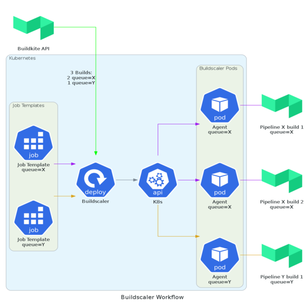

# Overview

Buildscaler is a Kubernetes controller that will autoscale a fleet of Buildkite agent pods on your Kubernetes cluster.  The agent pods will scale up to run waiting builds and gracefully scale down when agents are idle.

## Architecture

Build pipelines have unique requirements based on the needs of each build.  Some builds require lots of compute resources while others require specialized volumes to be mounted into the build pod.  To allow users to customize the pods that are launched to run a Buildkite build, Buildscaler requires the user to create a Kubernetes Job that specifies the pod template that will be used to run a Buildkite build job.  Buildscaler will use the Kubernets Job's pod template to launch build pods to run waiting Buildscaler builds.

Built-in Kubernetes controllers cannot be used to control the number of running build pod replicas. Blindly using a replica count to scale the number of workers can cause builds to be terminated while they are still running.  Instead, Buildscaler creates and manages pods itself.  This allows it to scale up the number of pods needed to run waiting builds and then gracefully scale down the number of pods when there are excess pods that are not running builds.  Buildscaler does this by asking the Buildkite agent running the pod to gracefully terminate when it is idle.

The combination of allowing a user to specify their build pipeline agent needs as a native Kubernetes resource and gracefully scaling the number of running agents based on waiting builds makes Buildscaler a great fit for running Buildkite builds on Kubernetes.



# Installation

## Command line instructions

Follow these instructions to install Buildscaler from the command line.

### Prerequisites

* A EKS cluster, Kubernetes 1.16 or higher configured with [IAM Roles for Service Accounts}(https://docs.aws.amazon.com/eks/latest/userguide/iam-roles-for-service-accounts.html)
* kubectl

### Create an IAM role for the buildscaler service account

1. Enable OIDC for service accounts in your cluster by following the instructions [here](https://docs.aws.amazon.com/eks/latest/userguide/enable-iam-roles-for-service-accounts.html).
2. Create service account linked IAM role for Buildscaler:

Create an IAM role for the Buildscaler pod and configure it with the following policy:

```json
{
    "Version": "2012-10-17",
    "Statement": [
        {
            "Sid": "",
            "Effect": "Allow",
            "Action": [
                "aws-marketplace:RegisterUsage",
                "aws-marketplace:MeterUsage"
            ],
            "Resource": "*"
        }
    ]
}
```
Create a trust relationship on the IAM role, with the following fields replaced

* Replace `$AWS_ACCOUNT_ID` with your AWS account ID (e.g. 123456789012)
* Replace `$OIDC_PROVIDER` with your cluster's OIDC provider's URL (e.g. oidc.eks.us-east-1.amazonaws.com/id/AAAABBBBCCCCDDDDEEEEFFFF00001111)
* Replace `$NAMESPACE` with the namespace buildscaler will run in (defaults to the default namespace)
* Replace `$BUILDSCALER_SERVICE_ACCOUNT_NAME` with the name of the buildscaler service account (defaults to "buildscaler")

```json
{
  "Version": "2012-10-17",
  "Statement": [
    {
      "Effect": "Allow",
      "Principal": {
        "Federated": "arn:aws:iam::$AWS_ACCOUNT_ID:oidc-provider/$OIDC_PROVIDER"
      },
      "Action": "sts:AssumeRoleWithWebIdentity",
      "Condition": {
        "StringEquals": {
          "$OIDC_PROVIDER:sub": "system:serviceaccount:$NAMESPACE:$BUILDSCALER_SERVICE_ACCOUNT_NAME"
        }
      }
    }
  ]
}
```

### Install from the command line

Set environment variables (be sure to modify BUILDKITE_ORG_SLUG, BUILDKITE_ACCESS_TOKEN and BUILDKITE_AGENT_TOKEN with your organizations values):

    export NAME=buildscaler
    export NAMESPACE=default # change this as necessary. Buildscaler will run pods in this namespace
    export BUILDKITE_ORG_SLUG=my-organization-slug # REQUIRED: change this to your company's Buildkite org-slug
    export BUILDKITE_ACCESS_TOKEN=0123456789abcdef0123456789abcdef0123456789abcdef01 # REQUIRED: fill in with your Buildkite access token
    export BUILDKITE_AGENT_TOKEN=aaaabbbbccccddddeeeeffffaaaabbbbccccddddeeeeffffff # REQUIRED: fill in with your Buildkite agent token
    export BUILDSCALER_SERVICE_ACCOUNT_ROLE_ARN=arn:aws:iam::123456789012:role/buildscaler # REQUIRED: fill in with the ARN of the IAM role for buildscaler
To deploy Buildscaler, use the script:

    ./manifests/deploy.sh

## Uninstall

To remove Buildscaler, delete the Buildscaler deployment then delete any Buildscaler job templates that have been created.

    $ kubectl -n$NAMESPACE delete Deployment,Secret,ServiceAccount,Role,RoleBinding -l app.kubernetes.io/name=$NAME
    $ kubectl -n$NAMESPACE delete jobs,pods -l app.elotl.co=buildscaler

## Install in non-EKS cluster
You have to have kustomize installed.
Fill in your AWS credentials to [aws_secret.yaml](deploy/overlays/other-providers/aws_secret.yaml).
Fill in your Buildkite Org in [buidscaler-deploy.yaml](deploy/base/buildscaler-deploy.yaml#L31)
Fill in your Buildkite tokens in [buildscaler-secrets.yaml](deploy/base/buildscaler-secrets.yaml#L9)
Run `kubectl apply -k deploy/overlays/other-providers`

## Running Buildscaler

### Options

```
  --token TEXT                    Buildkite API access token. Can be specified
                                  as an environment variable
                                  BUILDKITE_ACCESS_TOKEN [required]

  --buildkite-org TEXT            The buildkite organization slug the
                                  controller will look for jobs in [required]

  -n, --namespace TEXT            Namespace to look for jobs in, leave blank
                                  for all namespaces. Buildscaler must run with
                                  a service account that has access to the
                                  namespace

  --sync-interval INTEGER         Number of seconds to wait between syncing
                                  jobs

  --healthz-address TEXT          Address the healthz server will listen to
                                  requests on (defaults to all)

  --healthz-port INTEGER          Portthe healthz server will listen to
                                  requests on

  --disconnect-after-idle-timeout INTEGER
                                  The number of idle seconds to wait before an
                                  agent is shut down. Used to scale down idle
                                  agents and pods

  --agent-startup-timeout         INTEGER
                                  Timeout in seconds for agents to register
                                  themselves in Buildkite after starting their pod

  --kubeconfig TEXT               Path to the kubeconfig file, if unspecified,
                                  will use InClusterConfig. Can also be
                                  specified with the environment variable:
                                  KUBECONFIG

  -v, --verbose                   More logging output
  --max-agent-lifetime INTEGER    Default perion (in seconds) after which
                                  agents will be killed. Can be overridden per
                                  agent using job annotation

  --help                          Show this message and exit.
```

## Configuring a Buildscaler Build
In Buildkite, create a build pipeline with one or more build steps.  Configure each build step to run on a single queue (e.g. `queue=my_buildkite_queue`). _Note: each build step can use a different queue but there must be a Buildscaler job configured to run builds for each queue._

Create a Kubernetes Job resource with a pod template that is capable of running a Buildkite build step.  The job resource must have the following properties:

- A pod template specifying a container image with everything needed to run the build step including an image, environment variables, secrets for pulling from a private repo, a secret containing the Buildkite agent token, etc..  Baking the Buildkite agent into an image is preferred to downloading the agent for each pod but both workflows are covered in [Installing the Agent](#installing-the-agent) below.
- The Kubernetes Job’s `spec.parallelism` must equal `0`. This prevents the Kubernetes JobController from attempting to run the job itself.
- A label on the job identifying the job as a job managed by Buildscaler
- A label on the job specifying a buildkite job queue.
- (optional) You can also specify how many builds can run in parallel for a particular pipeline with the `buildscaler.elotl.co/max-active-builds` annotation. This is useful for controlling parallelism or limiting builds to be serial via setting it to 1.

```yaml
apiVersion: batch/v1
kind: Job
metadata:
  labels:
    app.elotl.co: buildscaler
    buildscaler.elotl.co/queue: my_buildkite_queue
  annotations:
    buildscaler.elotl.co/max-active-builds: '1'
```

- (optional) You can also specify Persistent Volume Claim size, mount path, storage class and created PVC lifecycle will be managed by Buildscaler. E.g.:
```yaml
apiVersion: batch/v1
kind: Job
metadata:
  labels:
    app.elotl.co: buildscaler
    buildscaler.elotl.co/queue: my_buildkite_queue
  annotations:
    buildscaler.elotl.co/pvc-size: '10Gi'
    buildscaler.elotl.co/pvc-mount-path: '/var/lib/buildkite-agent'
    buildscaler.elotl.co/pvc-storage-class-name: 'standard'
```

- A Kubernetes Secret containing the Buildkite agent token. That secret must be referenced from within the job’s pod template in order to run the agent inside pods. This is different from the `BUILDKITE_ACCESS_TOKEN` that was created when deploying buildscaler:

```yaml
apiVersion: batch/v1
kind: Job
  template:
    spec:
      containers:
        name: agent
      - envFrom:
        - secretRef:
            name: buildkite-secrets
---
apiVersion: v1
kind: Secret
metadata:
  name: buildkite-secrets
type: Opaque
data:
  BUILDKITE_AGENT_TOKEN: {{ buildkite_agent_token }}
```

Jobs can be changed and updated while buildscaler is running.  Typically a job will be updated in order to change the job’s pod template to include new environment variables, new image tags or anything else to make the build run correctly.  Since Kubernetes Job pod templates are immutable, the job must be deleted and recreated in order to be updated.  When a job is deleted and then recreated, previously created buildscaler pods associated with the job will be gracefully terminated by telling the Buildkite agent on the pod to shut down when it becomes idle.

## Details

* Buildscaler jobs are linked to buildscaler pods via the queue they listen to.  If 2 pods and agents are listening to the same queue, it is assumed that they were created by the same job. This puts some limitations on jobs.
* Two buildscaler jobs cannot share the same queue.
* A buildscaler job cannot listen to multiple queues.
* The Kubernetes job resource UID is used to identify buildscaler pods created with an out of date template.  Out of date pods are gracefully shut down.
* If a buildscaler pod has an associated agent but does not have an associated job (a buildscaler job associated with the pod’s buildkite queue) then the pod will be gracefully terminated.
* Any buildscaler pods configured with a queue that does not have both an associated buildscaler job and a running buildscaler agent associated with the pod will be deleted.
* If a pod does not have an associated running agent and the pod was created more than 10 minutes ago, the pod will be deleted.  This allows the agent time to start out and times out pods with failed agents.

## Installing the Buildkite Agent onto Build Pods
The agent can be baked into an existing docker image (e.g. android-ndk) or downloaded by an `initContainer` and shared with the pod's main agent container by placing the downloaded agent into an emptyDir volume.

```yaml
spec:
  containers:
  - command:
    - /data/buildkite/bin/buildkite-agent
    - start
    - --config=/data/buildkite/buildkite-agent.cfg
    - --tags=queue=my-build-queue
    envFrom:
    - secretRef:
        name: buildkite-secrets
    image: ellerbrock/alpine-bash-curl-ssl
    imagePullPolicy: IfNotPresent
    name: buildkite
    volumeMounts:
    - mountPath: /data
      name: data
  initContainers:
  - command:
    - bash
    - -c
    - curl -sL https://raw.githubusercontent.com/buildkite/agent/master/install.sh
      | bash
    env:
    - name: DESTINATION
      value: /data/buildkite
    envFrom:
    - secretRef:
        name: buildkite-secrets
    image: ellerbrock/alpine-bash-curl-ssl
    imagePullPolicy: Always
    name: installer
    volumeMounts:
    - mountPath: /data
      name: data
  restartPolicy: Always
  volumes:
  - emptyDir: {}
    name: data
```

# Metrics
Buildscaler exposes metrics in Prometheus format on port `9000`. You can add Prometheus annotations to the buildscaler deployment, so Prometheus will know where to scrape metrics from. Check [manifests](manifests/buildscaler-deploy.yaml) for an example.

Collected metrics:

| Metric name | Type |Description |
| ----------- | ---- | ----------- |
| active_agents_total | Gauge | Total number of running agents |
| active_pods_total | Gauge | Total number of running pods |
| buildkite_jobs_running_total | Gauge | Total number of running Buildkite jobs |
| needed_pods_total | Gauge | Total number of needed pods |
| sync_loop_runs_total | Counter | Total number of sync loop runs |
| sync_loop_errors_total | Counter | Total number of errors in sync loop | 
